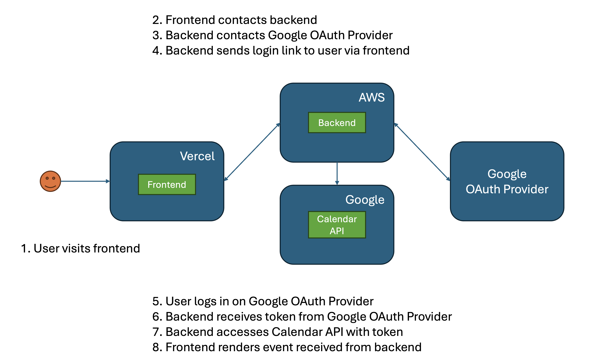

# Meet app

This is a Meet app.

## Architectural diagram

## Features

---
### Feature 1: Filter Events By City
#### Scenario 1: When user hasn’t searched for a city, show upcoming events from all cities.
##### User Story
As a user,  
I should be able to see events from all cities when I haven’t searched for a specific city  
So that I can browse all available events.

##### Gherkin
**Given** user hasn’t searched for any city;  
**When** the user opens the app;  
**Then** the user should see a list of upcoming events.

#### Scenario 2: User should see a list of suggestions when they search for a city.
##### User Story
As a user,  
I should be able to see a list of city suggestions when I start typing in the search bar  
So that I can quickly find the city I want.

##### Gherkin
**Given** the main page is open;  
**When** user starts typing in the city textbox;  
**Then** the user should receive a list of cities (suggestions) that match what they’ve typed.  

#### Scenario 3: User can select a city from the suggested list.
##### User Story
As a user,  
I should be able to select a city from the suggestions  
So that I can view events specific to that city.

##### Gherkin
**Given** user was typing “Berlin” in the city textbox AND the list of suggested cities is showing;  
**When** the user selects a city (e.g., “Berlin, Germany”) from the list;  
**Then** their city should be changed to that city (i.e., “Berlin, Germany”) 
AND the user should receive a list of upcoming events in that city.

---

### Feature 2: Show/Hide Event Details
#### Scenario 1: An event element is collapsed by default.
##### User Story
As a user,  
I should be able to see event details hidden by default  
So that the interface remains clean and uncluttered.

##### Gherkin
**Given** user had opened the events list  
**When** user views the list  
**Then** user will see all event elements collapsed

#### Scenario 2: User can expand an event to see details.
##### User Story
As a user,  
I should be able to expand an event to see its details  
So that I can learn more about the event.

##### Gherkin
**Given** an event had been collapsed  
**When** user clicks on the "Show Details" button  
**Then** user will see the event expand to show its details

#### Scenario 3: User can collapse an event to hide details.
##### User Story
As a user,  
I should be able to collapse an event after viewing its details  
So that I can minimize the information when I no longer need it.

##### Gherkin
**Given** an event had been expanded  
**When** user clicks on the "Hide Details" button  
**Then** user will see the event collapse to hide its details

---

### Feature 3: Specify Number of Events
#### Scenario 1: When user hasn’t specified a number, 32 events are shown by default.
##### User Story
As a user,  
I should be able to see 32 events by default if I haven’t specified the number  
So that I can view a reasonable number of events without making adjustments.

##### Gherkin
**Given** user had not specified the number of events  
**When** user views the events list  
**Then** user will see 32 events by default

#### Scenario 2: User can change the number of events displayed.
##### User Story
As a user,  
I should be able to customize the number of events displayed  
So that I can adjust the list to suit my preferences.

##### Gherkin
**Given** user had wanted to see a specific number of events  
**When** user changes the number of events in the settings  
**Then** user will see the events list display the specified number of events

---

### Feature 4: Use the App When Offline
#### Scenario 1: Show cached data when there’s no internet connection.
##### User Story
As a user,  
I should be able to see cached event data when I am offline  
So that I can access information even without an internet connection.

##### Gherkin
**Given** user had no internet connection  
**When** user views the events list  
**Then** user will see cached event data

#### Scenario 2: Show error when user changes search settings (city, number of events).
##### User Story
As a user,  
I should be able to receive an error notification when I change settings without internet  
So that I understand why the app is not updating the events.

##### Gherkin
**Given** user had no internet connection  
**When** user changes search settings like city or number of events  
**Then** user will see an error message

---

### Feature 5: Add an App Shortcut to the Home Screen
#### Scenario 1: User can install the meet app as a shortcut on their device home screen.
##### User Story
As a user,  
I should be able to add the meet app as a shortcut to my device’s home screen  
So that I can quickly access the app.

##### Gherkin
**Given** user had been using the meet app  
**When** user chooses the option to install the app as a shortcut  
**Then** user will see the app added to their device’s home screen

---

### Feature 6: Display Charts Visualizing Event Details
#### Scenario 1: Show a chart with the number of upcoming events in each city.
##### User Story
As a user,  
I should be able to see a chart displaying the number of upcoming events in each city  
So that I can understand event distribution visually.

##### Gherkin
**Given** user had been viewing event data  
**When** user navigates to the charts section  
**Then** user will see a chart displaying the number of upcoming events in each city

---

## Notes
Currently, two official plugins are available:

- [@vitejs/plugin-react](https://github.com/vitejs/vite-plugin-react/blob/main/packages/plugin-react/README.md) uses [Babel](https://babeljs.io/) for Fast Refresh
- [@vitejs/plugin-react-swc](https://github.com/vitejs/vite-plugin-react-swc) uses [SWC](https://swc.rs/) for Fast Refresh
